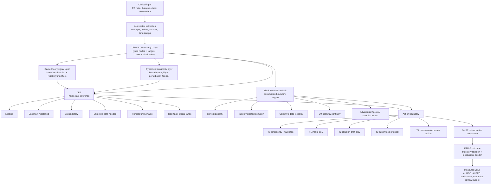

# Clinical Uncertainty Graph Explainer

Use this as a one-page explanation for leadership, CMIO review, clinical
informatics discussion, or research collaborators.

## Core Message

```text
JRE defines the uncertainty state.
Black Swan Guardrails define the allowed action boundary.
DHSE measures whether those boundaries matter using downstream outcomes.
```

The system is not asking an LLM, "Was this care good?" It converts messy
clinical input into an explicit expert-system graph, then uses that graph to
decide what is known, what is uncertain, what assumptions are weak, and what the
system is allowed to do.

## Architecture Diagram



## Layer Summary

| Layer | Technical Function | Output | Why It Matters |
|---|---|---|---|
| Clinical input | Notes, dialogue, chart facts, device data | Raw statements and structured facts | Starts with the real information state, not an idealized vignette |
| AI-assisted extraction | Maps text to candidate concepts and values | Candidate observations | AI helps populate the graph but does not own the safety decision |
| Clinical Uncertainty Graph | Expert-system typed nodes with ranges, priors, distributions, dependencies | Machine-readable graph | Makes uncertainty explicit and inspectable |
| Game-theory signal layer | Detects cost pressure, answer gaming, proxy mismatch, coercion, defensive minimization, and documentation closure | Strategic signal nodes and reliability modifiers | Prevents strategic reassurance from being treated as neutral evidence |
| Dynamical sensitivity layer | Measures distance to action-changing thresholds and coupled instability | Boundary fragility, perturbation flip risk, boundary sensitivity index | Identifies cases where small uncertainty can flip the safe action boundary |
| JRE | Node-state inference and uncertainty decomposition | Readiness state, JRI, boundary map, CLEAR questions | Defines what is missing, unreliable, contradictory, or unknowable |
| Black Swan Guardrails | Assumption and autonomy-boundary checks | Guardrail state, autonomy tier, assumption register | Defines what the system is allowed to do next |
| DHSE | Retrospective ED handoff benchmark | DSI and PTR-B comparison | Tests whether uncertainty and guardrails predict real downstream trajectory revision |

## Node Model

Each clinical fact becomes a node.

| Node Field | Example | Purpose |
|---|---|---|
| `node_id` | `oxygen_saturation` | Stable clinical concept |
| `raw_value` | `88 or 89 after a minute` | Original evidence |
| `numeric_value` | `88` | Computable value when available |
| `source` | `device` | Provenance |
| `source_reliability_prior` | `0.92` | Prior reliability by source |
| `confidence` | `0.86` | Observation reliability after penalties |
| `range_band` | `critical` | Expert-defined range interpretation |
| `range_severity` | `0.95` | Severity of range violation |
| `boundary_distance` | `2.0` | Distance to nearest worse threshold |
| `boundary_fragility` | `0.32` | How close the node is to an action-changing threshold |
| `perturbation_flip_risk` | `0.32` | Whether plausible small perturbation changes the range/action interpretation |
| `missingness_state` | `observed_uncertain` | Node state |
| `uncertainty_distribution` | `critical: 0.36, range_abnormal: 0.36` | Discrete uncertainty mass |
| `dependencies` | `respiratory_rate`, `sentence_test` | Related nodes needed for context |
| `action_implications` | `ESCALATE_OXYGENATION` | What this node changes operationally |

## Example Node

| Property | Value |
|---|---|
| Node | `oxygen_saturation` |
| Raw evidence | `It says 88 or 89 after a minute.` |
| Source | `device` |
| Source prior | `0.92` |
| Numeric value | `88` |
| Range band | `critical` |
| Range severity | `0.95` |
| Dominant issue | objective critical range |
| Action implication | `ESCALATE_OXYGENATION` |
| Interpretation | This is not "patient feels short of breath." It is a high-reliability objective node in a critical range. |

## How JRE Defines Uncertainty

| Uncertainty Type | Node State Example | Actionable Meaning |
|---|---|---|
| Missing | no respiratory rate in dyspnea case | Ask or obtain the missing variable |
| Uncertain | "oxygen is fine" without number | Do not treat as reassuring |
| Distorted | "no chest pain, just pressure" | Clarify vocabulary boundary |
| Contradictory | note says stable, SpO2 is 88 | Reconcile before closure |
| Objective needed | "BP normal" without value | Need number/device/chart confirmation |
| Remote unknowable | ECG absent in chest pressure | Cannot infer remotely/from note alone |
| Critical range | lactate 4.2, SpO2 88 | Escalates action pressure |

## Game-Theory Signals

| Strategic Signal | Why It Matters | Graph / Action Effect |
|---|---|---|
| `care_avoidance_pressure` | Cost, work, or fear may make minimization unreliable. | Lowers reliability of patient/caregiver semantic nodes; do not downgrade risk for reassurance. |
| `answer_gaming_pressure` | Speaker may optimize answers to pass an automated workflow. | Raises strategic signal load; hold and verify. |
| `proxy_misalignment` | Speaker may not be the patient or may have incomplete/incentive-misaligned information. | Verify identity/authority; cap automation. |
| `coercion_or_observation_pressure` | Communication may be observed or unsafe. | Route to protected human workflow. |
| `defensive_minimization` | Stoicism/anxiety framing can distort symptom severity. | Ask concrete functional falsifiers. |
| `documentation_closure_pressure` | Notes may compress uncertainty into closure language. | Preserve uncertainty in handoff and summary evaluation. |

## Dynamical / Boundary-Sensitivity Signals

| Feature | Meaning | Example |
|---|---|---|
| `boundary_distance` | Distance to nearest worse clinical/action threshold. | BP 178 is 2 mmHg from 180 threshold. |
| `boundary_fragility` | How fragile the current action state is to small value changes. | SpO2 92, HR 118, lactate 2.4 are collectively near escalation thresholds. |
| `perturbation_flip_risk` | Whether plausible measurement uncertainty would flip range/action band. | Repeat lactate could move from borderline to abnormal. |
| `coupled_instability_load` | Multiple dependent nodes are borderline or abnormal together. | HR + lactate + BP all near worse bands. |
| `boundary_sensitivity_index` | Aggregate dynamical fragility of the graph. | High value means do not allow confident automation near the boundary. |

## How BSG Converts Uncertainty Into Action Boundaries

| Graph / Assumption Signal | Guardrail Interpretation | Allowed Action |
|---|---|---|
| Wrong patient/proxy signal | identity assumption breached | `FAIL_CLOSED`, intake only |
| Prompt injection or answer gaming | channel integrity breached | `FAIL_CLOSED` or `HOLD_AND_VERIFY` |
| Off-pathway stroke/anaphylaxis/bleeding signal | sentinel risk present | `ESCALATE`, hard stop |
| High graph action pressure | uncertainty too high for autonomy | route clinician or hold |
| Strategic signal load | source reliability is incentive-shaped | hold/verify or route clinician |
| High boundary sensitivity | small uncertainty could flip action tier | repeat/verify objective data before closure |
| Objective data unreliable/stale | objective-data assumption weak | hold and verify |
| Case outside validated domain | operating envelope breached | route clinician |
| Low graph pressure, no breached assumptions | inside safe narrow path | allow with audit |

## How DHSE Measures Whether It Matters

DHSE applies the graph/governor retrospectively to ED admissions.

| Step | ED Handoff Application |
|---|---|
| Input | ED HPI, ED MDM, ED-available labs/imaging, PMH, treatments, disposition diagnosis |
| Graph | Build nodes for objective data, symptoms, diagnosis specificity, treatment intensity, level of care |
| JRE | Identify missingness, contradictions, objective instability, range violations |
| BSG | Identify assumption breaches and cap allowed action/reliance |
| DHSE score | DSI: disposition sufficiency index |
| Outcome | PTR-B: post-disposition trajectory revision with burden |
| Metrics | AUROC, AUPRC, top-decile enrichment, capture at 5/10/20% review budget |

## Actionability Matrix

| Repeated Pattern Found Retrospectively | Action For Health System |
|---|---|
| Low DSI + ICU upgrade within 24h | Review level-of-care mismatch and disposition handoff language |
| Nonspecific diagnosis + abnormal objective nodes | Add required acuity/uncertainty reconciliation to admission handoff |
| AI summary drops critical abnormal nodes | Modify AI summary guardrails and validation tests |
| Care-avoidance pressure + reassuring denial | Require concrete functional/objective falsifiers before reassurance |
| Boundary-sensitive vitals/labs near thresholds | Repeat or verify objective data before AI-supported closure |
| High missing load but no bad outcome | Identify documentation burden vs true safety signal |
| Graph contradiction load enriched for PTR-B | Build EHR warning or QA review around source conflicts |
| BSG `ROUTE_CLINICIAN` enriched for PTR-B | Use guardrail state for retrospective safety review queue |

## Honest Status

| Component | Status |
|---|---|
| Typed expert-system nodes | Implemented |
| Numeric range bands | Implemented for core objective nodes |
| Source reliability priors | Implemented |
| Discrete uncertainty distributions | Implemented |
| Strategic signal nodes / reliability modifiers | Implemented |
| Boundary fragility / perturbation flip risk | Implemented |
| Graph readiness summary | Implemented |
| BSG action-pressure integration | Implemented |
| BSG strategic-signal and boundary-sensitivity assumptions | Implemented |
| DHSE graph-derived risk factors | Implemented |
| UI graph section | Implemented |
| Outcome calibration | Pending real cohort |
| Bayesian posterior updating | Not yet implemented |
| Learned dependency weights | Not yet implemented |

## One-Sentence Pitch

> We are building a governable clinical AI safety layer: expert-defined clinical
> nodes make uncertainty explicit, JRE scores the uncertainty state, Black Swan
> Guardrails cap the allowed action, and DHSE tests whether those boundaries
> predict real downstream trajectory changes.
